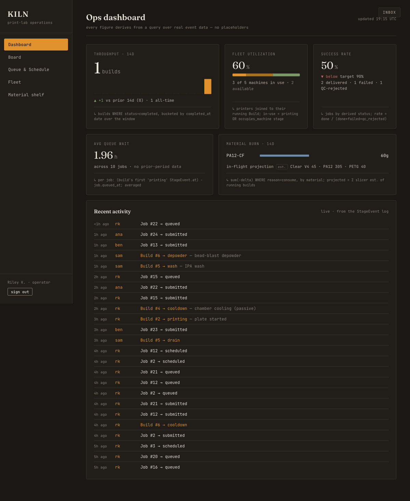
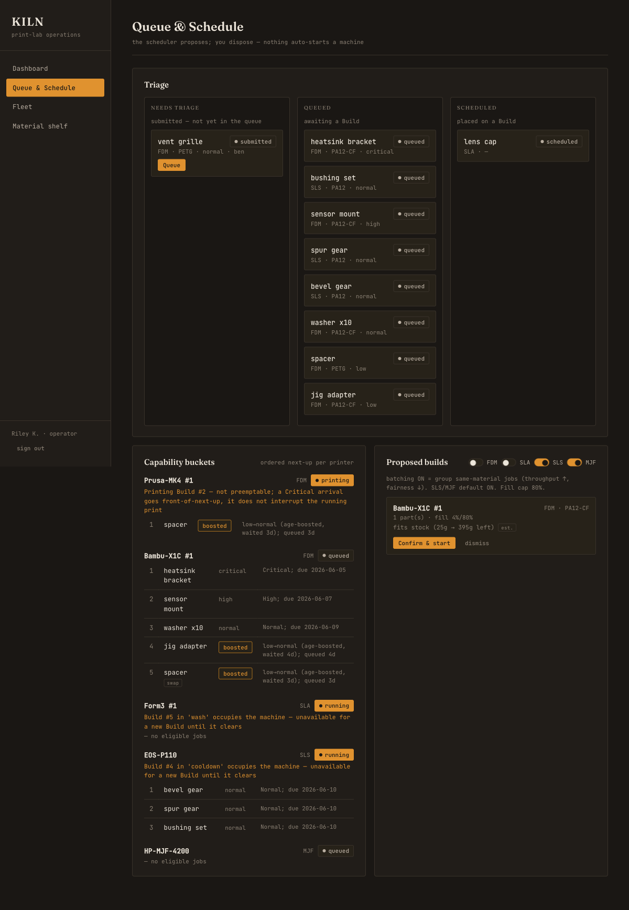
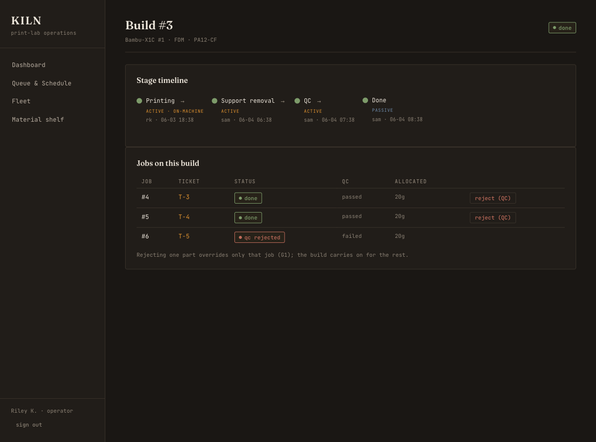
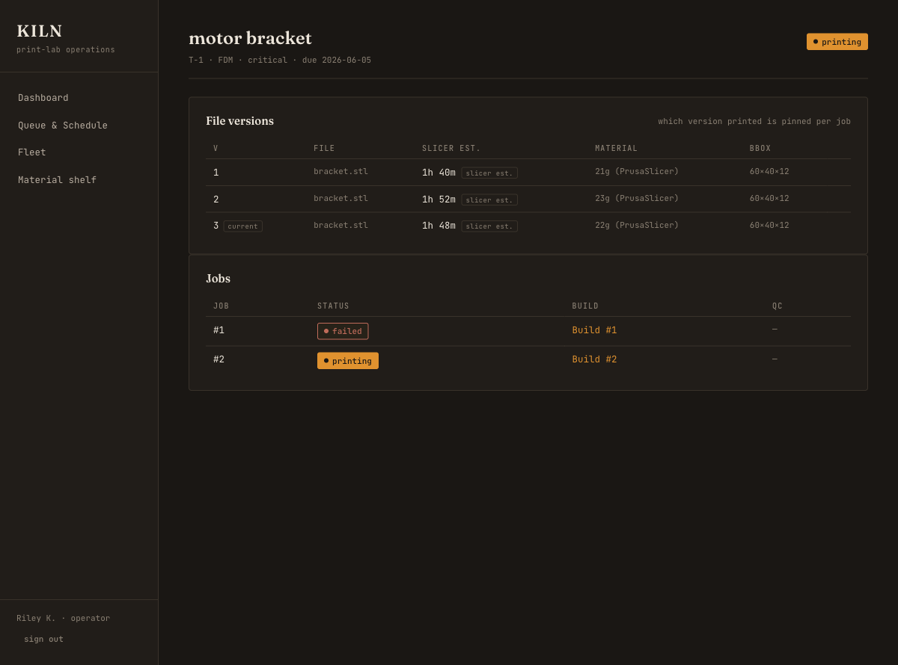
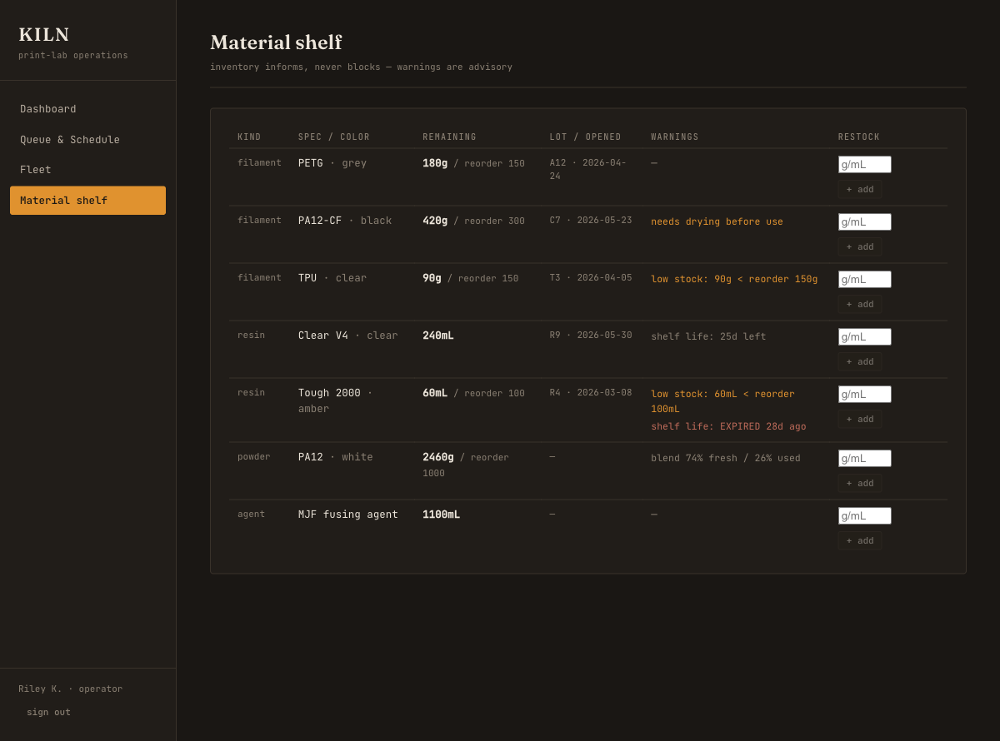
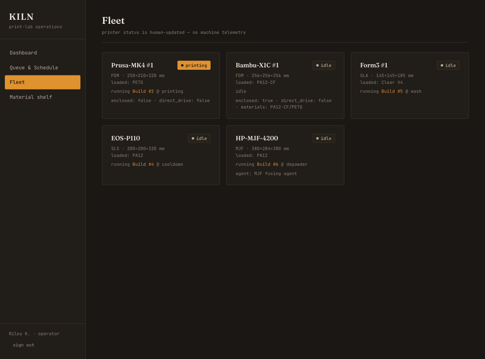
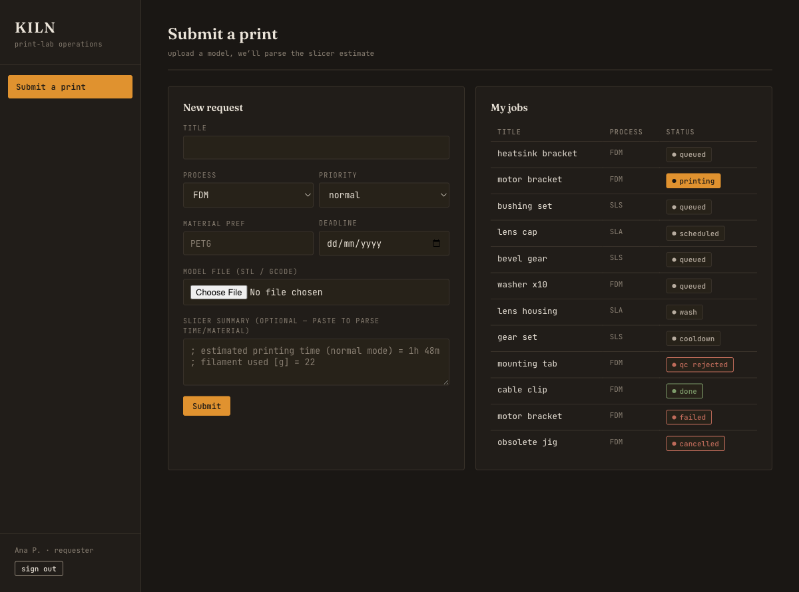

# KILN

**A real, deployable print-lab operations system for multi-process additive manufacturing
(FDM · SLA · SLS · MJF).** Engineers submit print tickets; a capability-aware scheduler
orders the work; jobs run individually or batched onto shared Builds; every Build moves
through process-specific stages; and a material inventory tracks consumption — without
faking machine telemetry.

> Built as the genuine article: FastAPI + PostgreSQL with real Alembic migrations, a React/
> TypeScript operator console, blob file storage, JWT auth, a slicer-summary parser, and a
> Dockerized one-command stack. 54 tests across the model, recipe engine, scheduler, and API.

---

## Screenshots

**Ops dashboard (the hero).** Every figure derives from a real query over real event data —
each tile shows its backing query (the `↳` line) and a real trend/target frame. Sparse data
shows real sparse numbers, never placeholders. "Quiet Utility" — dark warm instrument
readout, Fraunces + JetBrains Mono.



**Queue & Schedule board.** Triage lanes (needs-triage → queued → scheduled), capability
buckets with the *reason* each job is next + age-boost + swap flags + no-preemption /
machine-occupied notes, and proposed Builds with per-process batching toggles to confirm.



**Build detail.** The process recipe as a stage timeline (active / passive / on-machine,
with who advanced it and when) and the Jobs on the plate — here a shared Done Build where
one part was rejected at QC while its plate-mates shipped (the Build/Job split + derived
status in action).



**Ticket detail.** The FileVersion chain (each labelled "slicer est.") — a re-print where v2
failed and v3 printed — plus the ticket's jobs.



**Material shelf.** Inventory that *informs, never blocks*: low-stock, resin shelf-life,
filament drying, and powder refresh-ratio warnings, with restock/adjust.



**Fleet** (printer status — human-updated, no telemetry) and the **requester submit page**
(upload + parsed slicer estimate + track your jobs):




---

## What this is (and what it proves)

A lab that runs FDM, SLA, SLS and MJF printers has one operational problem: **order the
work, run it on the right machine, move each run through the right post-processing, and
know where the material went** — without lying about what the machines are doing. KILN is
that system, built to be honest about its limits.

It demonstrates operations + systems depth: clean data modeling, lifecycle/state design,
multi-process domain knowledge, scheduling judgment, and the discipline to build software a
technician would actually live in.

## What you can do

**As an operator** (`rk` / `rk-pw`):
- Read the **ops dashboard** — throughput, fleet utilization, success rate, avg queue wait,
  material burn — every number traceable to a query, framed against the prior period or a target.
- **Triage** submitted tickets into the queue.
- Read the **capability-aware schedule**: each printer's ordered next-up list with the reason
  it's first, age-boosted jobs marked, spool-swap and no-preemption notes surfaced.
- **Toggle batching** per process and **confirm a proposed Build** (the scheduler assembles
  compatible jobs onto one plate; you confirm — nothing auto-starts).
- **Drive a Build** through its recipe: advance / hold / resume / fail / cancel, and **reject a
  single part at QC** without blocking the rest of the plate.
- Manage the **material shelf**: see the full warning set, restock or hand-adjust stock.
- Browse the **fleet** and any ticket's **file-version history**.

**As a requester** (`ana` / `ana-pw`):
- **Submit a print** — upload an STL/gcode (or paste a slicer summary to get a parsed
  time/material estimate) — and **track your jobs'** live status.

## How it works (the lifecycle)

```
Submitted ─(triage)→ Queued ─(scheduler proposes → operator confirms)→ Scheduled on a Build
        → Printing → [process-specific stages] → Done    (+ Failed / On-hold / Cancelled from any stage)
```

Three ideas drive the architecture:

1. **Tickets and the queue are universal; stages and material accounting are
   process-specific** — defined by a per-process **recipe that is DATA, not code branches**
   ([`api/app/recipes/`](api/app/recipes/)). Adding a process = adding a recipe entry; the
   engine never changes. ([`docs/process-recipes.md`](docs/process-recipes.md))
2. **The Build/Job split.** A *Build* is one physical run on one printer; it carries one or
   more *Jobs* (each tied to a ticket/requester). Stages track at the **Build**; Job/Ticket
   status is **derived**; material decrements **once per Build** and allocates to Jobs. This
   is what makes SLS/MJF (many parts in one powder bed) and shared resin plates real.
   ([`docs/data-model.md`](docs/data-model.md))
3. **The scheduler is explicit, legible POLICY** — capability buckets → priority/deadline/
   age ordering (with an age-boost) → no preemption → operator-toggle batching → propose
   Builds for human confirmation. Not an opaque optimizer.
   ([`SCHEDULER_DESIGN.md`](SCHEDULER_DESIGN.md), [`docs/scheduler-notes.md`](docs/scheduler-notes.md))

## The honesty rules (the spine of the project)

- **No faked telemetry.** Statuses are human-updated (someone observed it). Only a
  `ManualAdapter` is implemented; Moonraker/OctoPrint are a documented, stubbed seam. The
  scheduler **proposes**; a human **confirms**; nothing auto-starts a physical machine.
- **Inventory informs, never blocks.** It projects consumption, flags shortfalls and
  shelf-life/drying/refresh conditions, and decrements on Done — but never prevents queuing
  or scheduling. Real labs override.
- **Estimates are labeled estimates.** Print time + material come from a parsed *slicer*
  summary and read "slicer est." (~10–20% off) — never implied as measured.
- **Pragmatic audit, not event-sourcing.** Append-only `StageEvent` + `InventoryTxn` are the
  truth-of-record; mutable status/quantity columns are fast reads written in the *same
  transaction* as their event. A reconcile check asserts `column == fold(events)`
  (`python -m app.audit`). Full event-sourcing would be over-engineering here, and we say so.
- **The dashboard cannot lie.** Every figure derives from a real query; each tile renders its
  backing query. Sparse data shows real sparse numbers or "needs more data" — never a
  placeholder.

## Stack

| | |
|---|---|
| **Backend** | Python · FastAPI · SQLAlchemy 2 · Alembic (real migrations) · PostgreSQL 16 |
| **Frontend** | React · Vite · TypeScript · TanStack Query · two surfaces (operator console + requester submit) |
| **Design** | "Quiet Utility" — Fraunces + JetBrains Mono, dark warm instrument palette ([`DESIGN_LANGUAGE.md`](DESIGN_LANGUAGE.md)) |
| **Auth** | JWT + bcrypt, roles `operator`/`requester` (no SSO) |
| **Storage** | blob store for STL/gcode — local volume in dev, S3-compatible seam |
| **Slicer** | summary parser for PrusaSlicer / Cura / Bambu + manual structured-paste fallback |
| **Ops** | Docker Compose (db + api + web); production multi-stage nginx image |

## Run it (dev)

```bash
cp .env.example .env
docker compose up --build                          # db + api + Vite
docker compose exec api python /app/db/seed.py     # load the cross-process demo data
```

- Operator console → http://localhost:5173 · API docs → http://localhost:8000/docs
- Demo logins: operator `rk` / `rk-pw` · requester `ana` / `ana-pw`
- Run the tests: `docker compose run --rm --no-deps --entrypoint pytest api -q`

See [`docs/stack.md`](docs/stack.md) for the SQLite local-dev fallback.

## Deploy (production)

A multi-stage nginx image serves the static bundle and reverse-proxies `/api`; the API runs
multiple uvicorn workers and migrates on start. One command:

```bash
cp .env.example .env        # set a strong JWT_SECRET and POSTGRES_PASSWORD first
docker compose -f docker-compose.prod.yml up --build -d
# app → http://localhost:8080
```

Full pre-flight checklist + hosted options (Fly.io / Railway / VPS) are in
[`docs/deploy.md`](docs/deploy.md).

## The build, phase by phase

| Phase | What landed | Docs |
|---|---|---|
| 0 | Real skeleton (compose, Alembic wired, health endpoints) + operator wireframes | `docs/stack.md`, `docs/wireframes.md` |
| 1 | Full data model + migration: Build/Job split + FileVersion chain + pragmatic audit + seed | `docs/data-model.md` |
| 2 | Recipe engine: validated transitions, universal side-states, multi-Job advancement | `docs/process-recipes.md` |
| 3 | The scheduler (centerpiece): capability buckets, ordering+age-boost, no-preemption, batching | `docs/scheduler-notes.md` |
| 4 | REST API + slicer parsing + inventory + on-Done decrement + notifications + auth | `docs/api.md`, `docs/inventory.md` |
| 5 | Operator console + requester submit; ops dashboard (every metric a real query) | `docs/ui.md` |
| 6 | Dashboard design-quality pass (Quiet Utility), production image, deploy prep, this README | `docs/deploy.md` |

Each phase shipped with tests and stopped at a review gate.

## Scope fences (deliberately NOT built)

No faked telemetry, no print-settings/orientation optimization, no slicer *integration* (we
parse, we don't slice), no full event-sourcing, no email/SMS/SSO/billing. Documented future
seams: real printer adapters (Moonraker/OctoPrint), email notifications, a true 3D nester,
failure-photo gallery, QR job labels, per-stream powder accounting, S3 blob backend.

## License

MIT — see [`LICENSE`](LICENSE).
